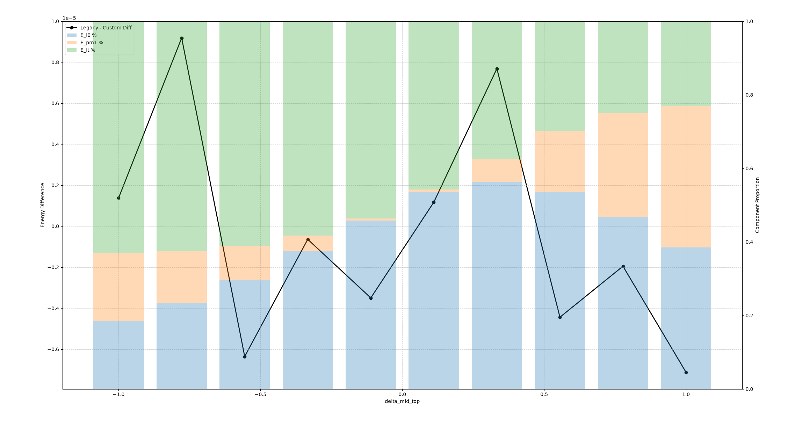

# Getting Started

* Install [Espresso](https://github.com/espressomd/espresso)
* in a terminal run: `./pypresso /full/path/to/your/script.py`

***

# Python Prototyping for Modern ELC & ELCIC

This repository contains a clean, test-driven Python implementation of Electrostatic Layer Correction (ELC) and ELC with Image Charges (ELCIC). It serves as a modern, independently validated prototype aimed at replacing the complex and unmaintainable legacy implementations within the ESPResSo molecular dynamics package.

By utilizing Python, this project allows for rapid iteration, easier visualization, and algebraic isolation of individual energy and force contributions before migrating the final, high-precision algorithms to C++.

## Methodology: Test-Driven Development

The codebase follows a strict Test-Driven Development (TDD) approach to ensure mathematical accuracy. Systems are built with incremental complexity:

1. Define a simple test system.
2. Establish a robust reference solution (Analytical, Brute Force Direct Sum, 2D Ewald).
3. Implement the ELC/ELCIC contribution and match the reference exactly.
4. Scale up complexity and repeat.

## Repository Structure

The repository is divided into three main components, reflecting the iterative approach to validating electrostatic corrections:

### `common/`

Shared utilities and infrastructure for the testing environment.

* **`generators/`**: Scripts to generate particle positions and charges.
* **`legacy/`**: Wrappers for the legacy ESPResSo implementations to serve as comparative baselines.
* **`plotting/`**: Visualization tools for tracking error convergence, parameter interpolations (lerping), and individual energy/force contributions.

### `elc/`

Implementation and validation of Regular ELC (2D+h slab systems without dielectric interfaces). Divided into `energy/` and `force/` calculations, stepping through incremental test cases:

* **`_1_big_box_neutral/`**: Tests near-field ($E_{near}$) against a Direct Sum reference by diminishing PBC influence.
* **`_2_small_box_neutral/`**: Tests far-field ($E_{far}$) against a 2D Ewald reference.
* **`_3_madelung/`**: Validates against the analytical Madelung energy of a 2D crystal lattice.
* **`_4_non_neutral/`**: Introduces a homogeneous neutralizing background correction for systems where $\sum q \neq 0$.

### `elcic/`

Extension of the ELC implementation to support dielectric interfaces using image charges. Divided into `energy/` and `force/`, and categorized by interface complexity:

* `_1_` to `_3_single_plate/`: Isolates near-field interactions and validates the reflection of charges against a single dielectric boundary.
* `_4_` to `_6_dual_plates/`: Handles simultaneous, bidirectional reflections across top and bottom interfaces. Includes analytical far-field treatment of higher-order reflection layers ($L_{\pm2}$).
* **`param_sweep/`**: Exhaustive validation scripts that sweep a massive parameter domain (box sizes, gaps, valences, dielectric contrasts) to ensure robustness.

## Outlook

The ultimate goal of this prototype is to establish a flawless, mathematically transparent reference model. Once precision targets are met across all parameter domains, this architecture will be ported to ESPResSo's C++ core with Kokkos support for hardware acceleration.
